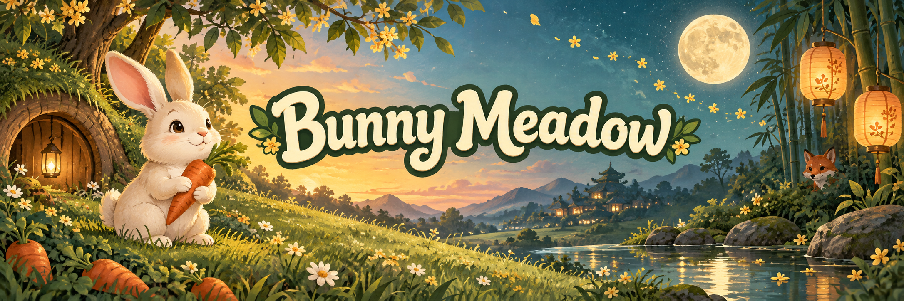

# Bunny Meadow



A family-tone woodland game about a rabbit kit named Mei climbing from her burrow to
the moon on one Mid-Autumn night. Phaser 4 + Vite + TypeScript, playable on the web
today, with a Steam desktop build planned.

Play on GitHub Pages: [hjnworks.github.io/BunnyMeadow](https://hjnworks.github.io/BunnyMeadow/)

## Status

Version 0.1.0. Story milestones M0-M5 are done: Meadow arcade, Moon Tasks, the full
Story through the moon finale, and Endless are web-playable. I1 (seeded biome route) and
I2 (slots, items, goat) are in the tree. The next version tag waits until I3-I4 land.

## Develop

Requires Node 20+. Commands below use PowerShell syntax.

```powershell
npm ci        # install exact dependencies
npm run dev   # local dev server
npm run build # build gate: path/jump/endless checks, tsc, and vite build
```

## Documentation

Start at the [docs index](docs/README.md). The design hub is [docs/GDD.md](docs/GDD.md);
the derived world model, bestiary, items, Endless detail, and rendering language live in
the subtrees linked from the index.

## Contributing

Read [CONTRIBUTING.md](CONTRIBUTING.md). Commits follow Conventional Commits and pull
requests must pass CI.

## License

Source-available, all rights reserved. See [LICENSE](LICENSE). Dependencies keep their
own licenses (Phaser is MIT).
