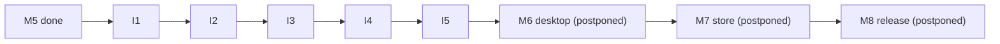

# Bunny Meadow — Web Iterations

Story milestones M0-M5 are done. Desktop and store milestones (M6-M8) are postponed while the
web build keeps improving. Ongoing web work is tracked here as numbered iterations. Build order
and the milestone list stay in [../ROADMAP.md](../ROADMAP.md).

## Scheme

- An iteration is a small, shippable batch of web changes with its own page.
- Each page lists the data and doc deltas and the design pages whose `planned` facts graduate to
  `live` when it ships.
- Iterations ship to Pages one at a time (the "ship to Pages after each change that touches the
  playable build" rule).
- Iterations do not renumber milestones. M6-M8 keep their numbers and sit at the end of the
  roadmap.

## The current track

| Iteration | Theme | Turns these `planned` into `live` |
| --- | --- | --- |
| I0 (done) | Repo hygiene | LICENSE, CONTRIBUTING, CHANGELOG, CI on PRs, Conventional Commits, `v0.1.0` |
| [I1](i1-biome-route.md) (done) | Biome route and shorter bands | route walker, `bandMeters`, tier jitter |
| [I2](i2-creatures-items.md) (done) | Creatures and items in data | enemy/item slots, biome rosters, item catalog |
| [I3](i3-theme-rendering.md) (done) | Theme and rendering | palettes.json, sky lerp, weather, night lighting |
| [I4](i4-audio-i18n.md) (done) | Audio and i18n | the remaining open M5 items |
| [I5](i5-bunny-jump.md) (docs) | Bunny Jump under Moon Tasks | climb stays `planned` until the code pass |

## Relationship to milestones

The desktop and store milestones resume after the web build is where it should be. See the
transfer notes in [../ROADMAP.md](../ROADMAP.md) for what carries into Electron unchanged.
