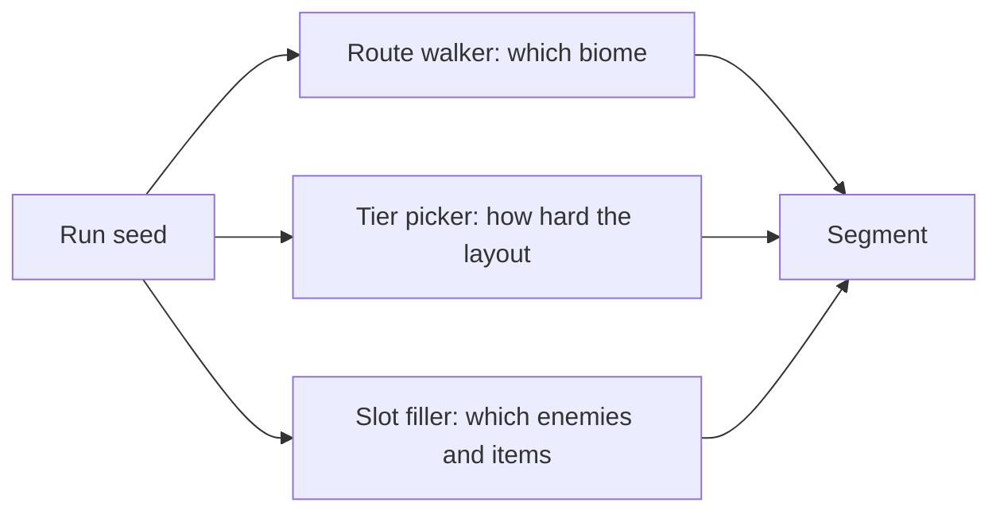

# Endless — Design

Endless Meadow Run is the infinite left-to-right runner built from Story chunk prefabs.
The player sets the pace under a difficulty-scaled mist wall that trails behind and
speeds up with distance. Hub: [../../GDD.md](../../GDD.md). World model:
[../../universe/README.md](../../universe/README.md).

This page is the target design. Route and tier axes are live (I1). Slot filler, skins,
and seed-entry UI remain planned. Gaps are what the later iterations in
[../../iterations/README.md](../../iterations/README.md) close.

## Problem this design fixes

Before I1, two facts made every run read the same:

1. Environments advanced by absolute distance only: fixed bands at 400, 800, 1200, 1700,
   2200 m. A typical Moonlit run ended near 145 m (see [tuning.md](tuning.md)), so a
   player never left the meadow band.
2. Tier was a pure function of distance, so two seeds of the same preset showed the same
   escalation. Enemies are still baked into each chunk file (I2).

I1 replaces (1) and (2) with a seeded route walker and tier jitter. Slot filler and
layout skins wait for later iterations.

## Three independent axes

A segment of an Endless run is chosen along three axes that used to be one:

1. Route walker (live, I1): which biome comes next. Seeded walk over the biome graph
   ([../../universe/biome-graph.md](../../universe/biome-graph.md)). Band lengths are
   drawn from a per-difficulty `bandMeters` range, and an altitude-climb bias grows with
   distance so water and dusk can appear early while runs still trend upward.
2. Tier picker (live, I1): how demanding the layout is. Still rises with distance, with a
   seeded jitter of plus or minus one tier and the existing breather cadence, so two runs
   at the same metre differ.
3. Slot filler: which enemies and items occupy the chunk. Chunks declare slots (see
   [chunk-contract.md](chunk-contract.md)); the filler draws from the current biome's
   roster ([../../creatures/README.md](../../creatures/README.md)) and item table
   ([../../items/placement.md](../../items/placement.md)).

Because these are independent, the same layout file can be skinned to any biome its
hazard vocabulary allows, and the same biome can present many enemy mixes.

## Seed handling

- A run seed drives one `mulberry32` stream, as today, so a seed reproduces a run.
- The lobby already shows seeds per leaderboard row. The design adds a seed entry field so
  a player can replay or share a seed, and a daily seed derived from the date so everyone
  gets the same route once a day.
- The three axes each draw from the same stream in a fixed order, so adding an axis does
  not change how an old seed reads only if the draw order is preserved. I1 reset seeds
  because the walker and jitter consume extra rng draws. Old 0.1.0 seeds do not replay.

## The mist wall

The chase is a mist wall behind the player. Sprout has no chase pressure; other presets
speed the wall up with distance. Falls and water cost a heart and respawn the player ahead
of the wall so a run is never instantly lost. The lantern item can push the wall back (see
[../../items/placement.md](../../items/placement.md)). Tuning per difficulty is in
[tuning.md](tuning.md).

## What stays

- Local per-difficulty leaderboard only, capped at the top 10 per difficulty in the
  browser save (`progress.endlessRuns`). No accounts, no global board.
- Carrots collected feed the pantry.
- Chunks remain pre-authored and build-validated (`scripts/check-endless-chunks.mjs`) so a
  streamed run is always completable.
