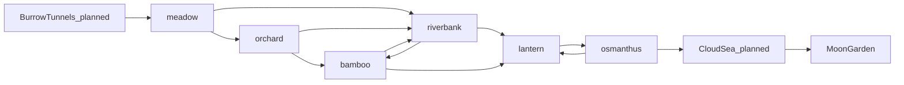

# Bunny Meadow — Biome Graph

This page turns the Ladder ([README.md](README.md)) into a graph. Nodes are
environments. Edges are the legal transitions between them, each with a named bridge
chunk that blends the two palettes and hours. Story walks a fixed path across this
graph. Endless walks a seeded path. Hub: [../WORLDS.md](../WORLDS.md).

## Nodes and edges

Edges are directed by default up the Ladder. Two back-edges exist on purpose so a
route can dip and re-climb: `osmanthus -> lantern` and `riverbank -> bamboo`. Sky
and moon (`cloudsea`, `moon`) are reachable in Story only, or in Endless only after
a key item unlocks them (see [../items/catalog.md](../items/catalog.md)).

## Bridge chunks

A bridge is a short chunk placed on an edge. It carries the palette from the source
rung on its left third and the destination rung on its right third, with the sky
token lerped across (see [../rendering/palettes.md](../rendering/palettes.md)). It
teaches no new verb and hosts no boss.

| Edge | Bridge chunk id (proposed) | Status |
| --- | --- | --- |
| meadow -> orchard | bridge_meadow_orchard | planned |
| orchard -> bamboo | bridge_orchard_bamboo | planned |
| orchard -> riverbank | bridge_orchard_riverbank | planned |
| bamboo -> riverbank | bridge_bamboo_riverbank | planned |
| riverbank -> lantern | bridge_riverbank_lantern | planned |
| bamboo -> lantern | bridge_bamboo_lantern | planned |
| lantern -> osmanthus | bridge_lantern_osmanthus | planned |
| tunnels -> meadow | bridge_tunnels_meadow | planned |
| osmanthus -> cloudsea | bridge_osmanthus_cloudsea | planned |
| cloudsea -> moon | bridge_cloudsea_moon | planned |

Until bridges ship, Endless does an instant palette snap at a band boundary, which
is the current behaviour (`getEnvBand` returns a hard band by distance in
`src/modes/endless/EndlessGenerator.ts`).

## Endless route walker (planned)

Today Endless picks the environment purely from distance: fixed bands at 400, 800,
1200, 1700, 2200 m in `src/data/endless.json`. Because a typical Moonlit run ends
near 145 m (see [../modes/endless/tuning.md](../modes/endless/tuning.md)), only the
meadow band is ever seen. The route walker replaces fixed bands with a seeded walk.

Rules:

1. Start at `meadow` (or `tunnels` on a dark-seed roll).
2. Hold the current rung for a band length drawn from the difficulty's
   `bandMeters` range (for example Moonlit 90-220 m). Shorter ranges mean faster
   scenery change.
3. At a band boundary, choose an outgoing edge from the current node. Edge weights
   come from an altitude-climb bias that grows with distance: early on, lateral and
   back-edges are likely, so water and dusk can appear before 400 m. Later, up-edges
   dominate so runs still trend toward the peak.
4. Never repeat the same rung more than twice in a row.
5. Sky and moon edges are closed unless the run holds the matching key item.
6. Insert the bridge chunk for the chosen edge before the first chunk of the new rung.

The walker only decides the biome sequence. Layout tier is a separate axis (see
[../modes/endless/design.md](../modes/endless/design.md)), so the same layout can be
skinned to any rung its hazard vocabulary allows.

## Hazard vocabulary per node

This constrains which chunk hazards and movers are legal on each rung, and it is the
same table the creature rosters key off.

| Node | Legal hazards | Legal movers | Signature |
| --- | --- | --- | --- |
| tunnels | gaps, void | vertical lifts | darkness, narrow |
| meadow | gaps | horizontal drift | gentle |
| orchard | gaps | horizontal drift | wider gaps |
| bamboo | gaps, shafts | vertical shafts | wall bounce |
| riverbank | current, gaps | drifting logs (x and y) | water |
| lantern | gaps | horizontal drift | glide zones |
| osmanthus | gaps, wind, void | wind gusts | rising floor |
| cloudsea | wind, void | wind platforms | sky |
| moon | void | low-gravity floats | low gravity |
