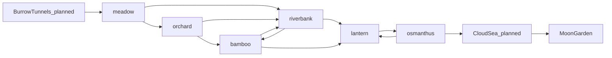

# Bunny Meadow — Biome Graph

This page turns the Ladder ([README.md](README.md)) into a graph. Nodes are
environments. Edges are the legal transitions between them, each with a named bridge
chunk that blends the two palettes and hours. Story walks a fixed path across this
graph. Endless walks a seeded path. Hub: [../WORLDS.md](../WORLDS.md).

## Nodes and edges

Edges are directed by default up the Ladder. Two back-edges exist on purpose so a
route can dip and re-climb: `osmanthus -> lantern` and `riverbank -> bamboo`. Sky
and moon (`cloudsea`, `moon`) are reachable in Story only, or in Endless only after
a key item unlocks them (see [../items/catalog.md](../items/catalog.md)).

## Bridge chunks

A bridge is a short chunk placed on an edge. It carries the palette from the source
rung on its left third and the destination rung on its right third, with the sky
token lerped across (see [../rendering/palettes.md](../rendering/palettes.md)). It
teaches no new verb and hosts no boss.

| Edge | Bridge chunk id (proposed) | Status |
| --- | --- | --- |
| meadow -> orchard | bridge_meadow_orchard | planned |
| orchard -> bamboo | bridge_orchard_bamboo | planned |
| orchard -> riverbank | bridge_orchard_riverbank | planned |
| bamboo -> riverbank | bridge_bamboo_riverbank | planned |
| riverbank -> lantern | bridge_riverbank_lantern | planned |
| bamboo -> lantern | bridge_bamboo_lantern | planned |
| lantern -> osmanthus | bridge_lantern_osmanthus | planned |
| tunnels -> meadow | bridge_tunnels_meadow | planned |
| osmanthus -> cloudsea | bridge_osmanthus_cloudsea | planned |
| cloudsea -> moon | bridge_cloudsea_moon | planned |

Until bridges ship (I3), Endless does an instant palette snap when the player enters a
new rung.

## Endless route walker (live, I1)

The walker in `src/modes/endless/EndlessGenerator.ts` reads `biomeGraph` and
`bandMeters` from `src/data/endless.json`. I1 omits tunnels, cloudsea, moon, key items,
and bridge chunks (no live content for those yet).

Rules in force:

1. Start at `meadow`.
2. Hold the current rung for a band length drawn from the difficulty's
   `bandMeters` range (for example Moonlit 90-220 m).
3. At a band boundary, choose an outgoing edge. Weight is `max(0.05, 1 + (climbBias - 1) * climb)`
   with `climbBias = min(2, distanceM / 400)`. Early runs favor lateral and dip edges
   (meadow to riverbank). Later runs favor up-edges.
4. Never stay on the same rung more than twice in a row if another edge exists.
5. Sky and moon edges stay closed (no live chunks, no key item yet).
6. No bridge chunk. The next biome's layout starts immediately. Sky snaps when the
   player enters that band.

The walker only decides the biome sequence. Layout tier is a separate axis (see
[../modes/endless/design.md](../modes/endless/design.md)), so the same layout can be
skinned to any rung its hazard vocabulary allows.

## Hazard vocabulary per node

This constrains which chunk hazards and movers are legal on each rung, and it is the
same table the creature rosters key off.

| Node | Legal hazards | Legal movers | Signature |
| --- | --- | --- | --- |
| tunnels | gaps, void | vertical lifts | darkness, narrow |
| meadow | gaps | horizontal drift | gentle |
| orchard | gaps | horizontal drift | wider gaps |
| bamboo | gaps, shafts | vertical shafts | wall bounce |
| riverbank | current, gaps | drifting logs (x and y) | water |
| lantern | gaps | horizontal drift | glide zones |
| osmanthus | gaps, wind, void | wind gusts | rising floor |
| cloudsea | wind, void | wind platforms | sky |
| moon | void | low-gravity floats | low gravity |
