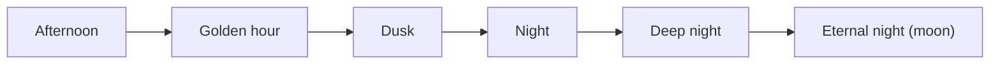

# Bunny Meadow — One Night Timeline

This page places every environment and mode on a single clock: the afternoon and
night of the Mid-Autumn Festival. The clock keeps hour transitions coherent, so a
rung's palette and lighting always match where it sits in the evening. Hub:
[README.md](README.md). Narrative beats: [../STORY.md](../STORY.md).

## The clock

| Hour | Rungs at this hour | What happens in Story |
| --- | --- | --- |
| Afternoon | Burrow Tunnels (planned), Meadow | Burrow Eve. Yue chases the glowing blossom. Soft Paws intro. |
| Golden hour | Orchard | Hedge Maze. The chase begins in earnest. |
| Dusk | Bamboo Grove, Riverbank | World 2. "She is safe above the clouds." |
| Night | Lantern Village | World 3 begins. Festival lanterns. Tu'er Ye and the tiger. |
| Deep night | Osmanthus Peak, Cloud Sea | Crane Summit. Ride to the Cloud Stair. World 4 climb. |
| Eternal night | Moon Garden | Guanghan Palace finale. |

The moon's hour never changes: Guanghan is the Palace of Vast Cold and holds an
eternal night regardless of the hour below it ([../LORE.md](../LORE.md#change-嫦娥)).

## How each mode uses the clock

- Story locks the hour per world, so a station's lighting is fixed. This is already
  the rule in [../WORLDS.md](../WORLDS.md) ("Story levels lock time of day per world").
- Endless treats the hour as a function of the current rung, not of wall-clock run
  time. When the route walker moves up a rung the hour advances, and the palette and
  night overlay cross-fade over the bridge chunk. A back-edge (osmanthus -> lantern)
  therefore steps the hour back one notch, which is allowed because the run is a
  wander, not a strict ascent.
- Meadow and Moon Tasks pick a single hour per map. Meadow may offer day and dusk
  variants of one backdrop.

## Weather by hour

Weather is a per-rung particle preset (see [../rendering/effects.md](../rendering/effects.md)),
but the hour gates which presets read well.

| Hour | Typical weather presets |
| --- | --- |
| Afternoon | pollen, dust motes |
| Golden hour | pollen, drifting leaves |
| Dusk | drizzle, drifting bamboo leaves |
| Night | fireflies, lantern ash |
| Deep night | wind streaks, blossom fall, cloud wisps |
| Eternal night | slow blossom fall, star drift |
